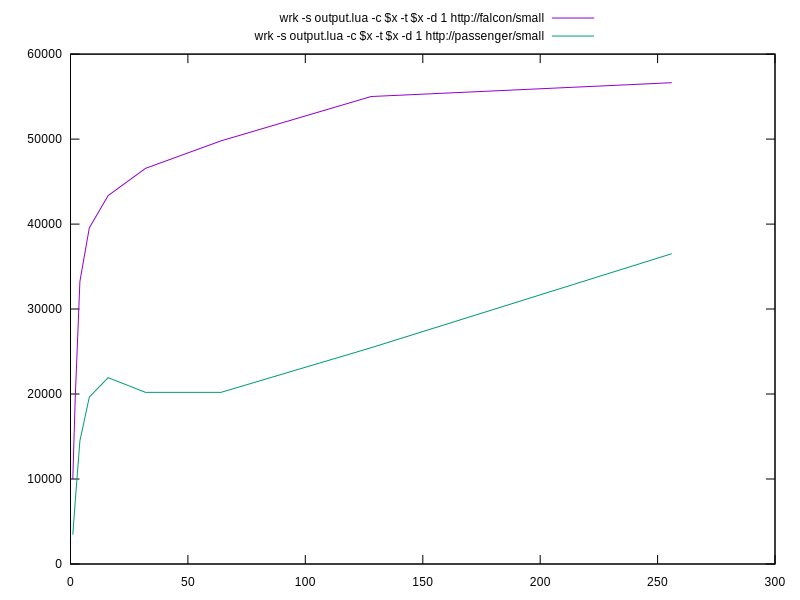
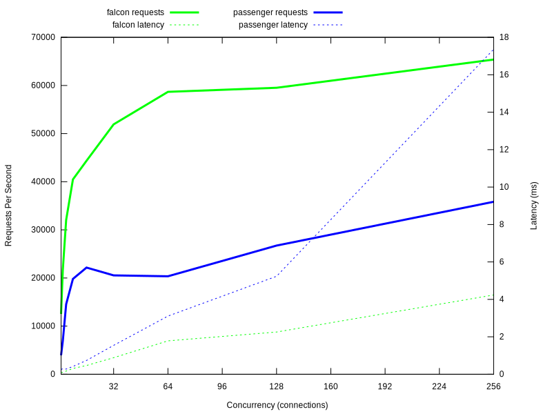
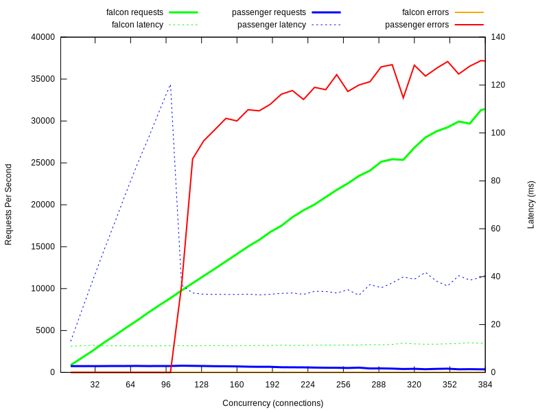

# Falcon vs Passenger

This is a synthetic benchmark comparing passenger with falcon.

## Usage

**This benchmark will only work on Arch Linux at the current time.**

First, generate the systems:

	rake falcon:base falcon:setup passenger:base passenger:setup

Once the systems have been generated, you can boot them (you may want to run them in separate terminals):

	rake falcon:run
	rake passenger:run

To run benchmarks:

	rake benchmark:small benchmark:large benchmark:sleep

## Results

### Small Response Benchmark

### Large Response Benchmark

### Sleep Response Benchmark

