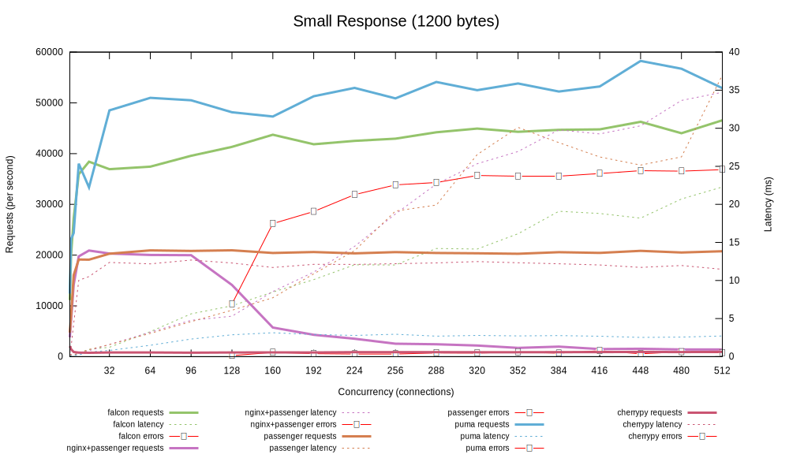
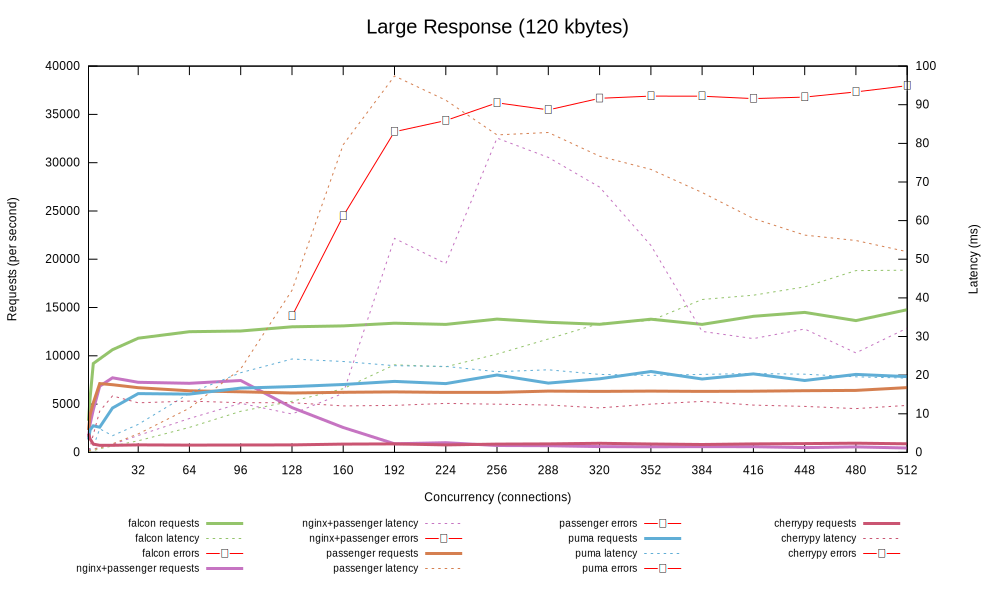
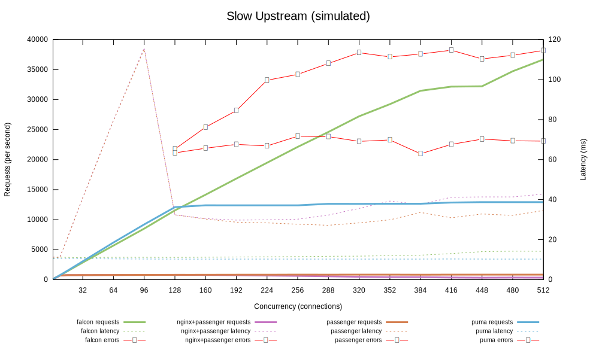

# Falcon vs Passenger

This is a synthetic benchmark comparing passenger with falcon.

## Usage

**This benchmark will only work on Arch Linux at the current time.**

First, generate the systems:

	rake falcon:base falcon:setup passenger:base passenger:setup

Once the systems have been generated, you can boot them (you may want to run them in separate terminals):

	rake falcon:run
	rake passenger:run

To run benchmarks:

	rake benchmark:small benchmark:large benchmark:sleep

## Results

### Small Response Benchmark



### Large Response Benchmark



### Sleep Response Benchmark



## System Details

### `/proc/cpuinfo`

4 cores, 8 hyperthreads: Intel(R) Core(TM) i7-4770 CPU @ 3.40GHz.

```
% cat /proc/cpuinfo
processor	: 0
vendor_id	: GenuineIntel
cpu family	: 6
model		: 60
model name	: Intel(R) Core(TM) i7-4770 CPU @ 3.40GHz
stepping	: 3
microcode	: 0x25
cpu MHz		: 1496.512
cache size	: 8192 KB
physical id	: 0
siblings	: 8
core id		: 0
cpu cores	: 4
apicid		: 0
initial apicid	: 0
fpu		: yes
fpu_exception	: yes
cpuid level	: 13
wp		: yes
flags		: fpu vme de pse tsc msr pae mce cx8 apic sep mtrr pge mca cmov pat pse36 clflush dts acpi mmx fxsr sse sse2 ss ht tm pbe syscall nx pdpe1gb rdtscp lm constant_tsc arch_perfmon pebs bts rep_good nopl xtopology nonstop_tsc cpuid aperfmperf pni pclmulqdq dtes64 monitor ds_cpl vmx smx est tm2 ssse3 sdbg fma cx16 xtpr pdcm pcid sse4_1 sse4_2 x2apic movbe popcnt tsc_deadline_timer aes xsave avx f16c rdrand lahf_lm abm cpuid_fault epb invpcid_single pti ssbd ibrs ibpb stibp tpr_shadow vnmi flexpriority ept vpid ept_ad fsgsbase tsc_adjust bmi1 avx2 smep bmi2 erms invpcid xsaveopt dtherm ida arat pln pts flush_l1d
bugs		: cpu_meltdown spectre_v1 spectre_v2 spec_store_bypass l1tf
bogomips	: 6786.73
clflush size	: 64
cache_alignment	: 64
address sizes	: 39 bits physical, 48 bits virtual
power management:
```

### Memory

```
% sudo lshw -short -C memory
H/W path           Device        Class          Description
===========================================================
/0/0                             memory         64KiB BIOS
/0/1                             memory         
/0/1/0                           memory         8GiB DIMM DDR3 Synchronous 2133 MHz (0.5 ns)
/0/43                            memory         System Memory
/0/43/0                          memory         DIMM [empty]
/0/43/1                          memory         8GiB DIMM DDR3 Synchronous 2133 MHz (0.5 ns)
/0/43/2                          memory         DIMM [empty]
/0/4a                            memory         256KiB L1 cache
/0/4b                            memory         1MiB L2 cache
/0/4c                            memory         8MiB L3 cache
/0/2                             memory         
/0/3                             memory         
```
