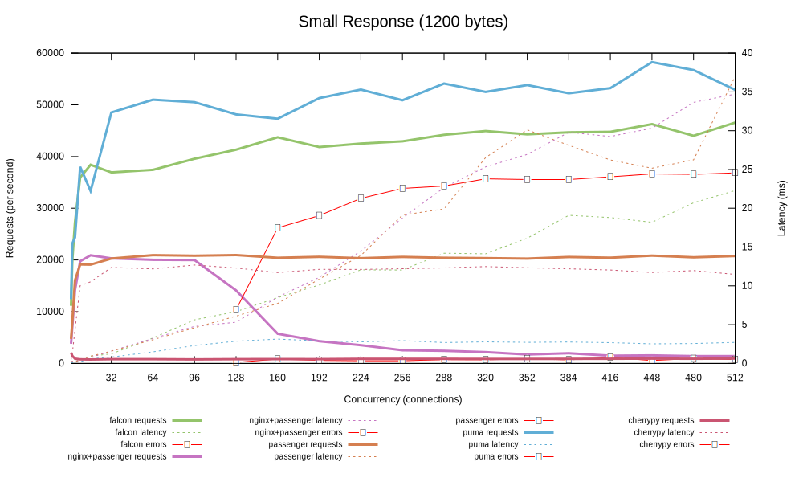
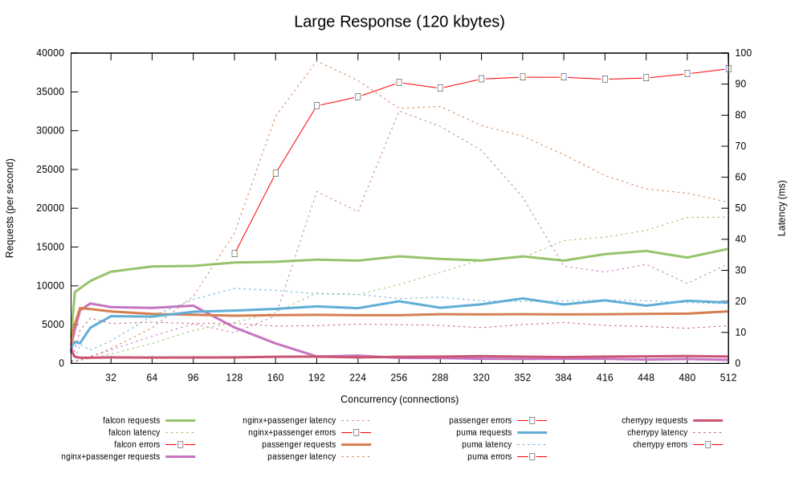
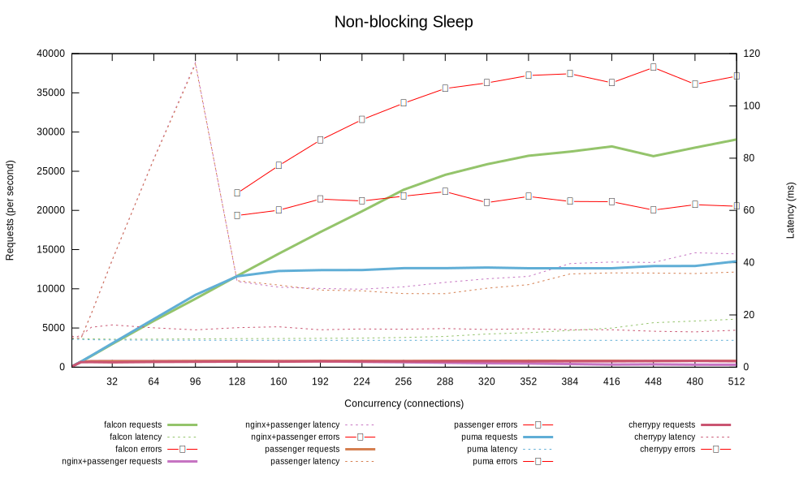
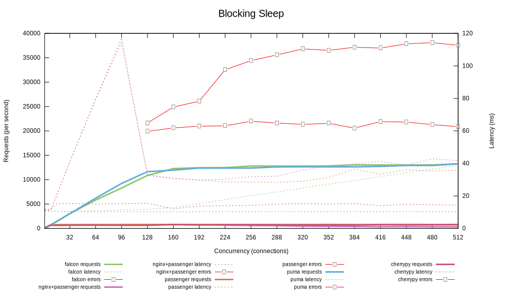

# Fix Plan — falcon-benchmark GitHub Pages

## Goal

Get the GitHub Pages site (`socketry.github.io/falcon-benchmark`) deploying correctly and fix the broken links in the readme.

---

## Issues

### 1. `readme.md` is stale and has broken image links

**Problem:**
- Title still reads "Falcon vs Passenger" — Passenger was replaced by Puma and Unicorn.
- Four image references point to files that do not exist in the repository:
  ```md
  
  
  
  
  ```
  These 404 on GitHub because the files were never created (the new site uses dynamic Chart.js charts, not generated SVGs).
- Usage instructions reference `rake` commands; the project now uses `bake` and Docker.

**Fix:**
- Replace the four broken image lines with a single link to the live GitHub Pages site.
- Update the title to "Falcon vs Puma vs Unicorn".
- Rewrite the Usage section to document the `docker compose` + `bake` workflow.
- Remove the outdated hardware spec (or defer to a separate results document).

---

### 2. `results/config.ru` has middleware that breaks static generation

**Problem:**
The Rack app used for the results site includes middleware that is either non-functional in a CI/static context or that prevents rackula from crawling all pages:

| Middleware | Problem |
|---|---|
| `Utopia::Exceptions::Mailer` | Requires SMTP configuration; will crash or silently fail in CI. |
| `Utopia::Localization` | Adds locale-prefixed routes (`/en/`, `/de/`, etc.) that rackula will attempt to crawl, most of which don't exist. |
| `Utopia::Session` | Session cookies are meaningless for a fully-static site; adds unnecessary complexity. |

**Fix:**
Strip the Rack app down to only what's needed for a read-only benchmark display site:

```ruby
#!/usr/bin/env rackup
# frozen_string_literal: true

require_relative 'config/environment'

self.freeze_app

use Rack::ShowExceptions unless UTOPIA.production?

use Utopia::Static, root: 'public'
use Utopia::Redirection::Rewrite, {'/' => '/*'}
use Utopia::Redirection::DirectoryIndex
use Utopia::Redirection::Errors, {404 => '/errors/file-not-found'}
use Utopia::Controller
use Utopia::Static

use Utopia::Content

run lambda { |env| [404, {}, []] }
```

---

### 3. GitHub Actions rackula command is missing `--base-url`

**Problem:**
The workflow runs:
```yaml
run: cd results && bundle exec rackula --output-path ../pages
```

Two sub-problems:
1. Rackula's `<base>` tag generation — `_page.xnode` renders `<base href="#{document.base_uri}"/>`. Without telling rackula the live site URL, the generated `<base>` tag will be relative to `localhost`, causing all JS module imports (chart.js) and CSS links to resolve against the wrong root when served from `socketry.github.io/falcon-benchmark/`.
2. The rackula CLI may require a subcommand (`static` or `generate`) depending on the gem version — verify this matches the installed version.

**Fix:**
Update the workflow step to pass the correct public base URL:
```yaml
- name: Generate documentation
  timeout-minutes: 5
  run: cd results && bundle exec rackula --base-url https://socketry.github.io/falcon-benchmark/ --output-path ../pages
```

Also verify the correct rackula CLI invocation by running `bundle exec rackula --help` locally against the version in `gems.rb`.

---

### 4. Root `bake.rb` is empty

**Problem:**
`bake.rb` at the repo root is empty. There are no tasks for running the benchmark pipeline (building and starting containers, running wrk, collecting results). Users have no entry point.

**Fix:**
Add `bake.rb` tasks that wrap the Docker Compose workflow:

```ruby
# frozen_string_literal: true

# Build all benchmark containers.
def build
  system("docker compose build")
end

# Run the full benchmark suite and write results to results/data/.
def benchmark
  system("docker compose up --abort-on-container-exit test")
end

# Tear down all containers.
def clean
  system("docker compose down --remove-orphans")
end
```

---

### 5. Session secrets committed in plain text (minor)

**Problem:**
`results/config/development.yaml` and `results/config/testing.yaml` contain `UTOPIA_SESSION_SECRET` values committed to the repository. Once the session middleware is removed (see issue 2), these files become irrelevant.

**Fix:**
After removing `Utopia::Session` from `config.ru`, delete or clear the secret keys from both YAML files to avoid confusion.

---

## Order of Work

1. Fix `results/config.ru` — remove unnecessary middleware (blocker for correct static generation).
2. Fix the rackula command in `.github/workflows/results.yaml` — add `--base-url`.
3. Rewrite `readme.md` — fix broken image links, update title and usage.
4. Add tasks to the root `bake.rb`.
5. Clean up session secrets from YAML config files.

---

## Verification

After making changes, verify locally before pushing to `main`:

```sh
cd results
bundle install
bundle exec rackula --base-url https://socketry.github.io/falcon-benchmark/ --output-path ../pages
# Inspect pages/ — confirm index.html loads chart.js correctly and has the right <base> tag.
```

Then push to `main` and confirm the GitHub Actions "Documentation" workflow completes without errors and the Pages site loads charts correctly.
